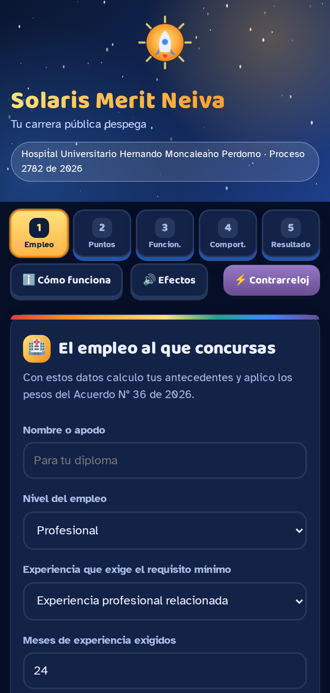
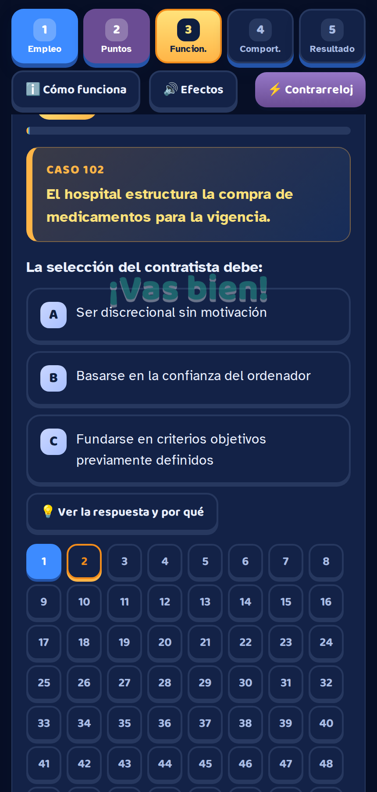
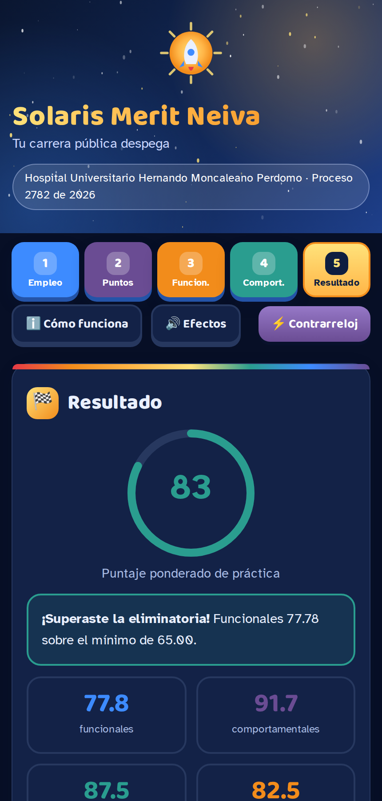

# Solaris Merit Neiva

Simulador de práctica de las pruebas escritas del **Proceso de Selección No. 2782 de 2026 – Empresas Sociales del Estado 2**, E.S.E. Hospital Universitario Hernando Moncaleano Perdomo (Neiva, Huila), convocado por el **Acuerdo CNSC N° 36 del 9 de abril de 2026**.

Funciona sin servidor, en un solo archivo HTML, y guarda todo en el navegador del dispositivo. No tiene cuentas, contraseñas ni envío de datos.

## Qué hay en el repositorio

| Archivo o carpeta | Para qué sirve |
|---|---|
| `index.html` | La app completa. Incluye una copia del banco por si el Excel no carga. |
| `presentacion.html` | Presentación narrada de 14 escenas, con voz y música incorporadas. |
| `presentacion.mp4` | La misma presentación como video, 1280×720, 4:06. |
| `guion-narracion.md` | El guion con los tiempos, por si quieres regrabar la voz. |
| `audio/` | La pista de narración con música, por separado. |
| `assets/` | Logo en SVG y PNG, e imagen de previsualización para redes. |
| `capturas/` | Pantallazos de la app, listos para el README o para redes. |
| `CREDITOS.md` | Ficha técnica: cómo está hecho cada componente. |
| `.nojekyll` | Evita que GitHub Pages procese el sitio con Jekyll. |
| `banco-preguntas.xlsx` | El banco editable: 120 casos, 360 preguntas funcionales y 30 comportamentales. La app lo lee con SheetJS desde el mismo repositorio. |
| `README.md` | Este documento. |

## Publicar en GitHub Pages

1. Crea un repositorio nuevo en GitHub, por ejemplo `solaris-merit-neiva`, y márcalo como público.
2. Descomprime el zip y sube **todo el contenido** con **Add file → Upload files**, arrastrando también las carpetas `assets`, `capturas` y `audio`. `index.html` y `banco-preguntas.xlsx` deben quedar en la raíz.
3. Confirma con **Commit changes**.
4. Ve a **Settings → Pages**. En *Source* elige **Deploy from a branch**; en *Branch* elige `main` y la carpeta `/ (root)`. Guarda.
5. Espera uno o dos minutos y abre la dirección que aparece: `https://TU-USUARIO.github.io/solaris-merit-neiva/`.

Si abres `index.html` con doble clic desde tu computador, el navegador bloquea la lectura del Excel por seguridad y la app usará su copia incorporada. Eso es normal: para que lea el Excel debe estar publicada o servida por HTTP.

## Actualizar las preguntas

1. Abre `banco-preguntas.xlsx` y edita la hoja **Funcionales** o **Comportamentales**.
2. En Funcionales, tres filas con el mismo `caso_id` forman un caso: comparten `texto_caso` y cambian el `enunciado`.
3. Escribe la respuesta como `a`, `b` o `c` en minúscula. Llena siempre `explicacion`, `porque_no` y `fuente`.
4. Pon `NO` en la columna `activa` para dejar una pregunta fuera sin borrarla.
5. En Comportamentales, cada opción vale de 1 a 3 puntos: 3 la conducta esperada, 2 la aceptable, 1 la inadecuada.
6. Sube el archivo al repositorio reemplazando el anterior. La app tomará las preguntas nuevas al recargar.

La copia incorporada en `index.html` no se actualiza sola: solo entra en acción si el Excel falla.

## Tamaños de simulacro

Corto: 15 casos (45 preguntas). Estándar: 30 casos (90 preguntas). Largo: 60 casos (180 preguntas). Si reduces el banco por debajo de esos números, la app deshabilita sola la opción que no alcanza.

## Reglas del concurso que aplica la app

| Prueba | Carácter | Peso | Mínimo |
|---|---|---|---|
| Competencias funcionales | Eliminatoria | 60 % | 65.00 |
| Competencias comportamentales | Clasificatoria | 20 % | — |
| Valoración de antecedentes | Clasificatoria | 20 % | — |

En las vacantes reservadas para personas con discapacidad los pesos cambian a 60 %, 30 % y 10 %, y en antecedentes solo puntúa la educación adicional. La casilla del paso 1 activa ese esquema.

**Valoración de antecedentes.** Los topes por factor son los del Anexo Técnico E.S.E. 2 (orden territorial): en el nivel profesional, 40 y 15 puntos de experiencia según cuál sea el requisito mínimo, 25 de educación formal, 5 de informal, 10 de ETDH académica y 5 de ETDH laboral; en el nivel técnico, 40 y 10 de experiencia, 20 de educación formal, 5 de informal, 5 de ETDH académica y 20 de ETDH laboral. El puntaje de experiencia es una **estimación**: la app asume que 60 meses adicionales al requisito mínimo llegan al tope. Puedes cambiar ese supuesto en la constante `MESES_TOPE` dentro de `index.html`.

## Vigencia normativa

Verificada a septiembre de 2026. La Resolución 1732 de 2026 derogaba la Resolución 3100 de 2019, pero fue revocada íntegramente por la Resolución 2080 de 2026, así que **la Resolución 3100 de 2019 y sus modificaciones siguen vigentes** y son la base de las preguntas de habilitación. Antes de publicar preguntas nuevas, confirma la vigencia en el normograma oficial, la Secretaría del Senado o SUIN-Juriscol.

## Aviso

Las preguntas son de práctica y fueron elaboradas a partir de normativa pública. **No son preguntas reales de una prueba de la CNSC**: las pruebas de los procesos de selección tienen carácter reservado (Ley 909 de 2004, artículo 31, numeral 3). Esta aplicación **no está afiliada, avalada ni patrocinada por la CNSC** ni por la E.S.E. Hospital Universitario Hernando Moncaleano Perdomo. Los puntajes son una estimación de estudio; la fuente oficial del proceso es SIMO.

## La app en imágenes

Hecho por Thommy Alcides Tonguino Noronha.
